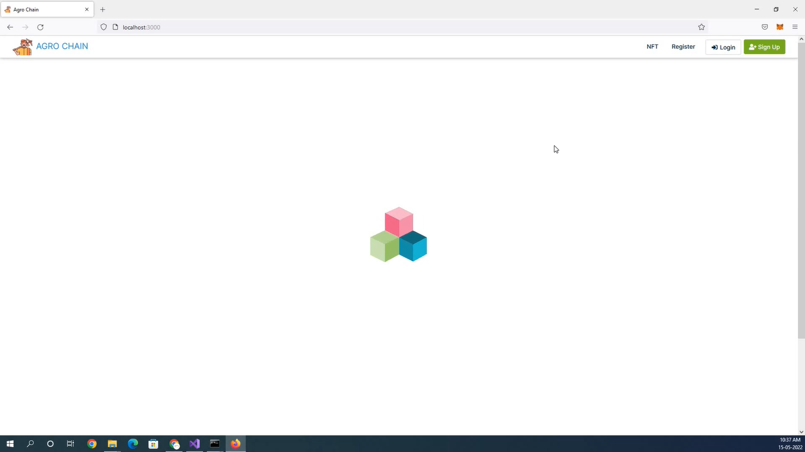
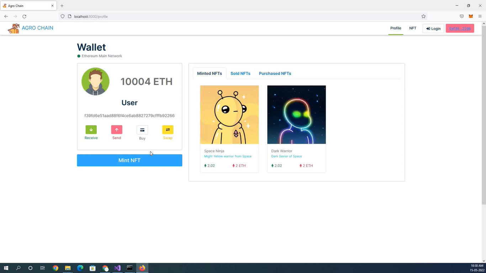
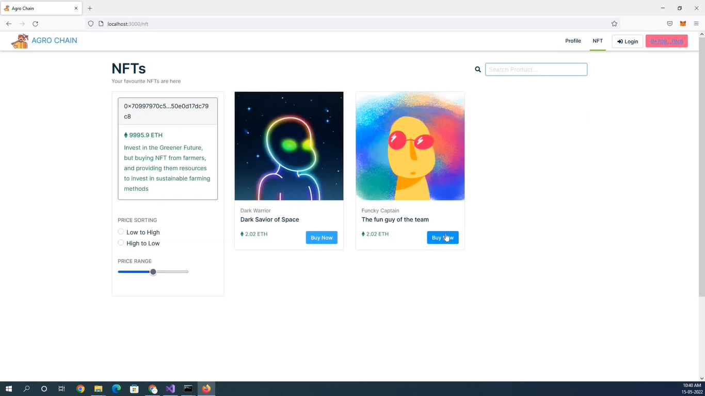
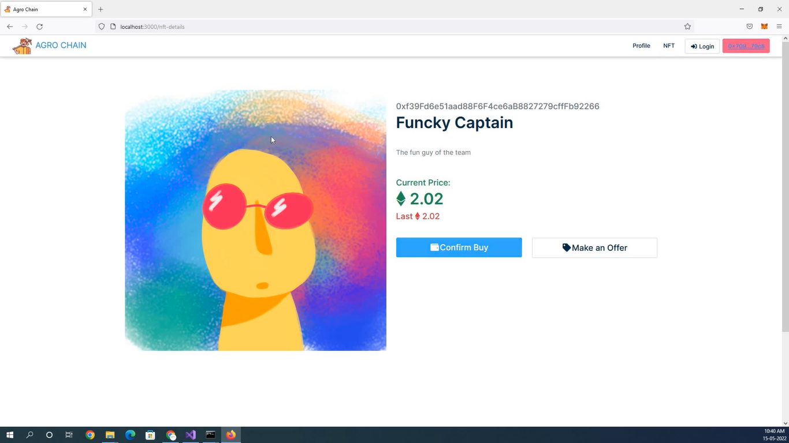

<h1 align="center">AgroChain</h1>

	
<strong>ArgoChain </strong>is an NFT application Based on Ethereum Blockchain written in Solidity Smart Contract, and using the power of React Frontend, and ether.js to interact with the Smart Contract present in the Ethereum Blockchain, a user can Upload & Mint (In IPFs), buy and Sell NFT, in the ArgoChain NFT marketplace.


## Features
- Mint NFT.
- Sell NFT in Marketplace.
- Buy NFT from Marketplace.
- User Dashboard to view all the NFT Minted, sold, and Purchased.


### 1. Clone/Download the Repository

```
git clone https://github.com/IntelegixLabs/AgroChain
```

### 2. Run the .NET Backend Application (fetches the historical pollution data from a public API):

```
cd AgroChain/agrochain/src/backend/Pollution.API
dotnet clean
dotnet build Pollution.API.sln
dotnet watch run --Pollution.API
```

### 3. Install Node/React Dependencies:

```
cd AgroChain/agrochain
npm install
```

### 4. Boot up local Hardhat development blockchain

```
npx hardhat node
```

### 5. Connect development blockchain accounts to Metamask
- Copy private key of the addresses and import to Metamask
- Connect your metamask to hardhat blockchain, network 127.0.0.1:8545.
- If you have not added hardhat to the list of networks on your metamask, open up a browser, click the fox icon, then click the top center dropdown button that lists all the available networks then click add networks. A form should pop up. For the "Network Name" field enter "Hardhat". For the "New RPC URL" field enter "http://127.0.0.1:8545". For the chain ID enter "31337". Then click save. 

<p align="center">
  
</p>


### 6. Migrate Smart Contracts
```
npx hardhat run src/backend/scripts/deploy.js --network localhost
```

### 7. Run Tests
```
npx hardhat test
```

### 8. Launch Frontend
```
npm run start
```


### 9. Project Architecture

<p align="center">
  
</p>

### 10. Application Screenshots

<br />
<p align="center">
  
  
  
  
  	
</p>
<br />


